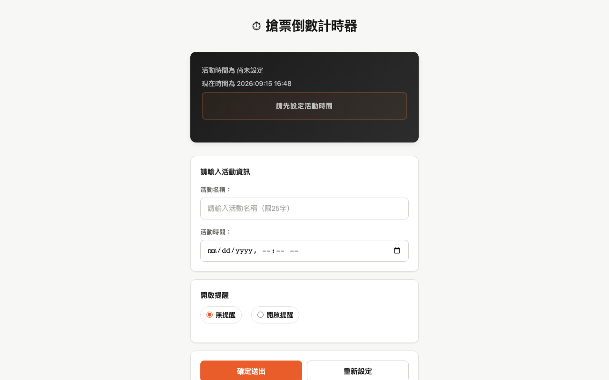

# 搶票倒數計時器 使用說明

## 這是什麼？

搶票倒數計時器，幫你精準倒數到指定時間。適用於演唱會搶票、限時開賣、活動報名等需要準時行動的場景。支援 URL 分享，把設好的倒數連結傳給朋友一起準備。

## 使用方式

1. 輸入活動名稱（限 25 字）
2. 設定目標日期與時間
3. 選擇是否開啟提醒（可設定提前幾分鐘通知）
4. 點擊「確定送出」開始倒數
5. 可透過網址列的 URL 參數分享給他人

## 功能特色

- **精準倒數**：以 `Date.now()` 差值計算，背景分頁被瀏覽器節流也不會跑偏
- **URL 分享**：設定好的倒數會編碼進網址，複製連結即可分享
- **瀏覽器通知**：可設定提前提醒，到時間自動彈出桌面通知
- **Cookie 記憶**：關閉頁面再開啟，上次的設定自動還原
- **跨裝置適配**：RWD 設計，手機與桌機都能使用

## 注意事項

- 瀏覽器通知需先允許權限（首次使用會詢問）
- 活動時間過期後會顯示「已過期」提示
- URL 分享的連結長度有限，活動名稱建議簡短
